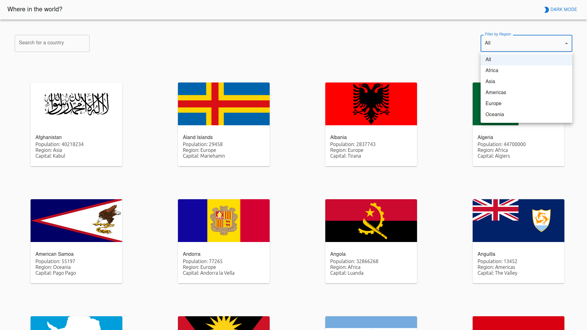
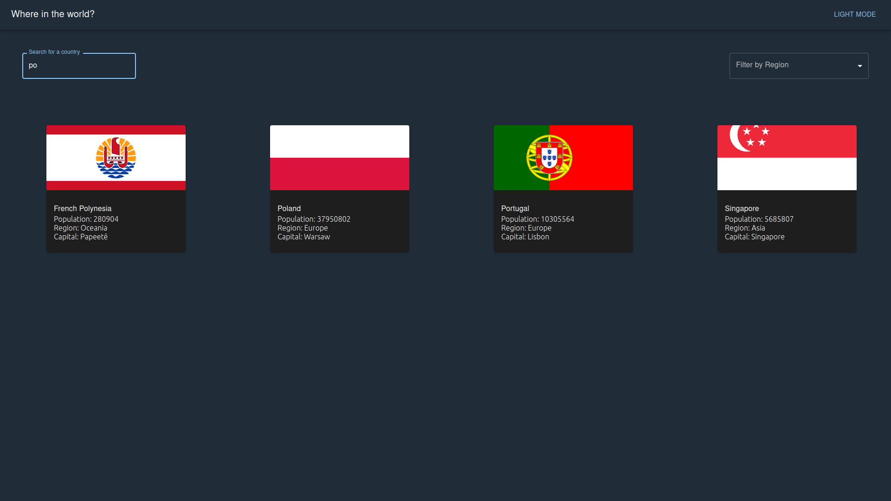
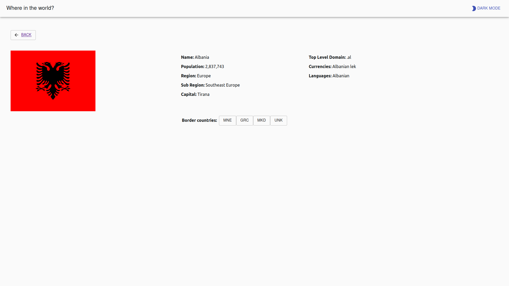

# Frontend Mentor - REST Countries API with color theme switcher solution

This is an almost ready solution to the [REST Countries API with color theme switcher challenge on Frontend Mentor](https://www.frontendmentor.io/challenges/rest-countries-api-with-color-theme-switcher-5cacc469fec04111f7b848ca). 

Since this is my only second React project, repo structure or applied funcionalities may not seem 100% optimal. 

## The challenge

Users should be able to:

- See all countries from the API on the homepage
- Search for a country using an `input` field
- Filter countries by region
- Click on a country to see more detailed information on a separate page
- Click through to the border countries on the detail page
- Toggle the color scheme between light and dark mode *(optional)*

## Built with

- Semantic HTML5 markup
- CSS custom properties
- Flexbox
- CSS Grid
- [React](https://reactjs.org/) - JS library (v 18.17.1)
- Material UI library

## What I learned

- create-react-app is no longer supported (that is why I have probably been facing problems with MUI imports and clashes with React version)
- attached data.json file presents data structure that is not updated (for example - currencies)
- styled can be a reasonable alternative to module.css if using MUI... next time for sure!

## How it looks like

light mode with filter active

dark mode - typing for a search

light mode - detail view

